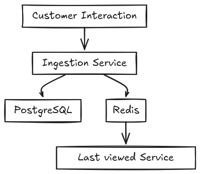
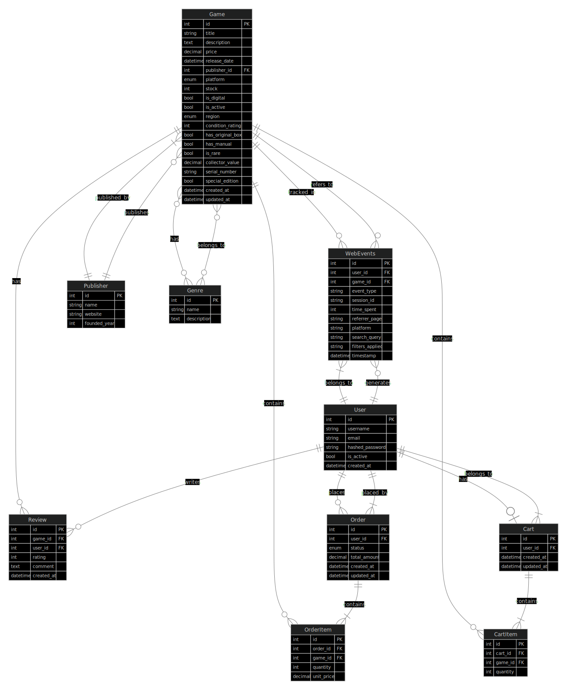

<p align="center">
  
</p>

<p align="center">
  <a href="https://github.com/fernando24164/real-time-ingestion/actions/workflows/run-tests.yml">
    
  </a>
  <a href="https://www.python.org/downloads/release/python-3130/">
    
  </a>
  <a href="https://fastapi.tiangolo.com/">
    
  </a>
</p>

# Real time ingestion

Handle real-time data ingestion and serve customer insights through a REST API.

## Features

Customers interactions will be sent to a multiple backends in the ingestion service. PostgresSQL will be store the data, and Redis will be used to store the last viewed product information.
Another service that depend on Redis will retrieve a list of last product viewed by the customers let the platform can personalize the product recommendations.



## Data model

The data model of game store is defined in the `app/models/game_store.py` file. It includes the following models:



### Legend

Line Types:

    Solid lines (--): Represent non-identifying relationships where entities can exist independently
      
    Lines with dots (-.-): Represent identifying relationships where one entity depends on the existence of another

Cardinality Markers:

    |o (Zero or one): The entity can have zero or one instance of the related entity
    || (Exactly one): The entity must have exactly one instance of the related entity
    }| (One or more): The entity must have at least one instance of the related entity
    o{ (Zero or more): The entity can have any number of instances of the related entity


## How to install

1. Install Dependencies:
   Ensure you have Python 3.9+ installed. Then, install the required dependencies:

   ```bash
   pip install -r requirements.txt
   ```

## Usage Examples

Launch docker-compose

```bash
docker-compose up -d
```

Run REST API in localhost:

```bash
uvicorn app.main:app --reload
```

The swagger UI can be accessed at `http://127.0.0.1:8000/docs`.

## Testing Instructions

To run the tests, use the following command:

```bash
pytest tests/
```

The test suite includes unit tests for the Athena client, S3 client, and PostgreSQL exporter. Mocking is used extensively to avoid dependencies on external services.

## Manage migrations with Alembic

Alembic is a database migration tool for SQLAlchemy. It allows you to manage database schema changes in a version-controlled way.

Use these commands to manage migrations:

Initialize migrations (first time only) with async:

```sh
alembic init --template async migrations
```  

Create a new migration when you change models:

```sh
alembic revision --autogenerate -m "description of changes"
```

Apply migrations:

```sh
alembic upgrade head
```

Rollback migrations:

```sh
alembic downgrade -1
```

## Load SQL mock data

Launch postgres container and access to /scripts folder
then run seed_database.py script. Read the README.md file in the scripts folder for more information.

## License

This project is licensed under the MIT License. See the LICENSE file for details.
