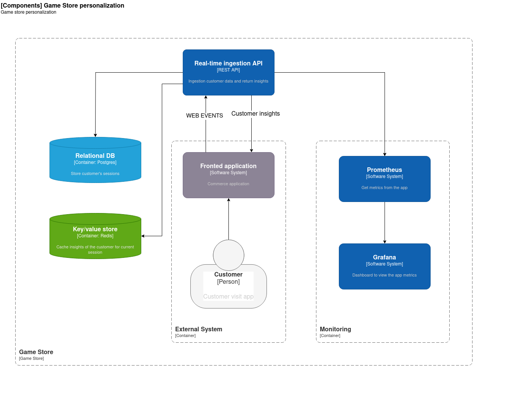

<p align="center">
  
</p>

<p align="center">
  <a href="https://github.com/fernando24164/real-time-ingestion/actions/workflows/run-tests.yml">
    
  </a>
  <a href="https://www.python.org/downloads/release/python-3130/">
    
  </a>
  <a href="https://fastapi.tiangolo.com/">
    
  </a>
</p>

# 🎮 Real-Time Game Store Ingestion API

**Real-Time Game Store Ingestion API** how to handle **real-time data ingestion** using **FastAPI**, **PostgreSQL**, and **Redis**, while providing a robust REST API for managing and analyzing customer interactions in a game store.

## Architecture


---

## 🛠️ Tech Stack

- **Backend**: [FastAPI](https://fastapi.tiangolo.com/) - High-performance Python web framework.
- **Database**: [PostgreSQL](https://www.postgresql.org/) - Relational database for persistent storage.
- **Cache**: [Redis](https://redis.io/) - In-memory data store for fast access to recent views.
- **Monitoring**: [Prometheus](https://prometheus.io/) & [Grafana](https://grafana.com/) - Metrics collection and visualization.
- **Containerization**: [Docker](https://www.docker.com/) - Simplified deployment and scaling.

---

## 🛠️ Event Ingestion Strategy

### Strategy Overview

The **Real-Time Game Store Ingestion API** employs a **hybrid ingestion strategy** to handle customer interaction events efficiently. This strategy combines **Redis** for real-time caching and **PostgreSQL** for persistent storage.

### How It Works

1. **Redis for Real-Time Caching**:
   - Events such as "VIEW," "ADD_TO_CART," and "PURCHASE" are immediately pushed to Redis.
   - Redis stores the **last viewed games** for each user in a **list data structure**, enabling quick retrieval for personalized recommendations.
   - The list is trimmed to a fixed size (e.g., 10 items) to optimize memory usage.

2. **PostgreSQL for Persistent Storage**:
   - All events are asynchronously written to PostgreSQL for long-term storage and analytics.
   - This ensures that historical data is available for generating insights, such as user preferences, engagement scores, and platform usage.

3. **Background Task Processing**:
   - Event ingestion is queued as a background task, allowing the API to respond quickly to clients while processing continues asynchronously.
   - This approach minimizes latency and ensures a smooth user experience.

4. **Monitoring and Metrics**:
   - Prometheus tracks ingestion performance, including request rates, error rates, and processing times.
   - Grafana visualizes these metrics, helping to identify bottlenecks and optimize the system.

---

### Why This Strategy?

This strategy is designed to balance **speed**, **scalability**, and **data integrity**:

- **Speed**: Redis provides low-latency access to frequently accessed data, such as the last viewed games.
- **Scalability**: By offloading real-time data to Redis and using PostgreSQL for analytics, the system can handle high event volumes without overwhelming the database.
- **Data Integrity**: PostgreSQL ensures that all events are stored reliably, even if Redis data is evicted due to memory constraints.

---

### Alternative Strategies

If your use case differs, consider these alternatives:

1. **Event Streaming**:
   - Stream events to multiple consumers.
   - Ideal for systems requiring **real-time analytics** or **multi-service event processing**.
   - Trade-off: Higher complexity and operational overhead.

2. **In-Memory Only**:
   - Store all events in-memory for ultra-low latency.
   - Suitable for **ephemeral data** or **short-lived sessions**.
   - Trade-off: No persistent storage; data loss on server restarts.

3. **Direct Database Writes**:
   - Write events directly to PostgreSQL or another relational database.
   - Simplifies architecture but may introduce **write bottlenecks** under high load.

4. **NoSQL Databases**:
   - Use a NoSQL database for flexible schema and high write throughput.
   - Suitable for systems with **unstructured data** or **horizontal scaling needs**.
   - Trade-off: May lack advanced querying capabilities for relational data.

---

## 📂 Project Structure

```
real-time-ingestion/
├── app/
│   ├── api/                # API endpoints and routing
│   ├── core/               # Core configurations and utilities
│   ├── db/                 # Database and Redis connection setup
│   ├── models/             # SQLAlchemy models for the database
│   ├── schemas/            # Pydantic schemas for request/response validation
│   ├── services/           # Business logic and service layer
│   ├── metrics.py          # Prometheus metrics integration
│   └── main.py             # FastAPI application entry point
├── config/                 # Configuration files for Prometheus and Grafana
├── scripts/                # Database seeding scripts
├── tests/                  # Unit and integration tests
├── docker-compose.yml      # Docker Compose configuration
├── pyproject.toml          # Python dependencies
└── README.md               # Project documentation
```

---

## 🛠️ Installation

### Prerequisites

- Python 3.9+
- Docker & Docker Compose

### Steps

1. **Clone the Repository**:
   ```bash
   git clone https://github.com/fernando24164/real-time-ingestion.git
   cd real-time-ingestion
   ```

2. **Install Dependencies**:
   ```bash
   uv sync --locked
   ```

3. **Run with Docker**:
   ```bash
   docker-compose up -d
   ```

4. **Seed the Database**:
   ```bash
   python scripts/seed_database.py
   ```

5. **Access the API**:
   - Swagger UI: [http://localhost:8000/docs](http://localhost:8000/docs)
   - Prometheus Metrics: [http://localhost:8001/metrics](http://localhost:8001/metrics)
   - Grafana Dashboard: [http://localhost:3000](http://localhost:3000) (Default login: `admin/admin`)

---

## 📊 Monitoring & Metrics

- **Prometheus**: Collects API metrics like request count, duration, and error rates.
- **Grafana**: Visualize metrics with pre-configured dashboards.

### Example Metrics

- **Requests per Minute by Endpoint**
- **95th Percentile Response Time**
- **Error Rate**
- **Average Active Requests**

---

## 🔬 Testing

Run the test suite using `pytest`:

```bash
pytest tests/
```

---

## 📚 API Endpoints

### Ingestion API
- **POST** `/api/v1/ingest`: Ingest customer interaction data.

### Customer Insights
- **GET** `/api/v1/customer/insights`: Generate personalized insights for a user.

---

## 🛠️ Manage Database Migrations

Use Alembic for database migrations:

1. **Initialize Migrations**:
   ```bash
   alembic init --template async migrations
   ```

2. **Create a New Migration**:
   ```bash
   alembic revision --autogenerate -m "Add new feature"
   ```

3. **Apply Migrations**:
   ```bash
   alembic upgrade head
   ```

4. **Rollback Migrations**:
   ```bash
   alembic downgrade -1
   ```

---

## 📈 Data Model


---

## 🤝 Contributing

We welcome contributions! Please follow these steps:

1. Fork the repository.
2. Create a new branch (`feature/my-feature`).
3. Commit your changes.
4. Push to the branch.
5. Open a pull request.

---

## 📄 License

This project is licensed under the [MIT License](LICENSE).

---

## 🌟 Acknowledgments

- Special thanks to the FastAPI, PostgreSQL, and Redis communities.
- [Tiangolo FastAPI template](https://github.com/fastapi/full-stack-fastapi-template)
- [Real world example in FastAPI deprecated but good to take a look](https://github.com/nsidnev/fastapi-realworld-example-app)

---

## 📬 Contact

For questions or feedback, feel free to reach out:

- **GitHub**: [fernando24164](https://github.com/fernando24164)

---

⭐ If you find this project helpful, please give it a star ⭐
